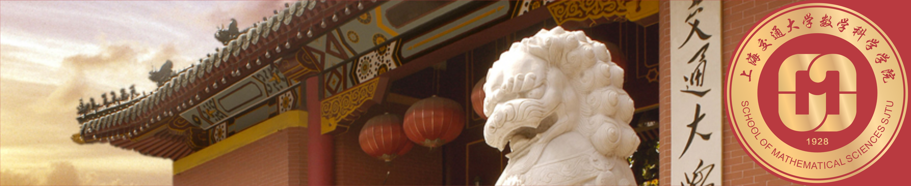

{:width="100%"}

## Conference on Stochastic Analysis, Stochastic Dynamical Systems and Stochastic Finance
{: style="text-align:center"}

#### Shanghai Jiao Tong University, School of Mathematical Sciences
{: style="text-align:center"}

 
-----

In recent years, fundamental advances have been made in different areas of stochastics -- from stochastic partial differential equations, ergodic theory to manifold valued stochastic differential equations as well as non-dominated models and transport methods in financial mathematics.

The School of Mathematical Sciences takes this opportunity to bring together those working on different areas of research related to stochastics to exchange on common issues, their respective approaches, new results and new research directions.
Alongside the presentation of each speaker, this conference also intends to facilitate research discussions and interactions in a stimulating and convivial atmosphere.

Attendance is open to any interested participants up to capacity.
Therefore, would you like to attend, we kindly ask you to register by sending a mail to [Hu Jie](mailto:hujie150@sjtu.edu.cn).

-----

**Place:** 
:   [School of Mathematical Sciences](http://math.sjtu.edu.cn/en)    
    [Shanghai Jiao Tong University](http://www.sjtu.edu.cn/)  
    Dongchuan Road 800, Shanghai

**Date:**
:   from September 6th to 8th

**Room:**
:   TBA

**Program and Abstracts:**
:   TBA

### Speakers

|-------------------------------+-----------------------------------------------+
| Name                          | Institution                                   |
|:------------------------------|:----------------------------------------------|
| Mathias Beiglboek             | Wien University                               | 
| Rama Cont                     | Oxford University                             | 
| Zhao Dong                     | Chinese Academy of Sciences                   |
| David Elworthy                | University of Warwick                         |
| Chunrong Feng                 | Loughborough University                       |
| Paolo Guasoni                 | Dublin City University                        | 
| Ying Hu                       | Rennes I University                           | 
| Peter Imkeller                | Humboldt University Berlin                    | 
| Michael Kupper                | Konstanz University                           | 
| Zhiming Ma                    | Chinese Academy of Sciences                   |
| Michael Roeckner              | Bielefeld University                          | 
| Mathieu Rosenbaum             | Polytechnic University Paris                  | 
| Mete Soner                    | Princeton University                          | 
| Shanjian Tang                 | Fudan University                              |
| Nizar Touzi                   | Polytechnic University Paris                  | 
| Martin Schweizer              | ETH Zurich                                    | 
| Guojing Wang                  | Suzhou University                             |
| Hao Xing                      | Boston University                             |
| Jie Xiong                     | Southern University of Science and Technology |
| Xichen Zhang                  | Wuhan University                              |
| Xu Zhang                      | Sichuan University                            |
|===============================|===============================================|

[//]: # ( Xuewei Li   Imperial College London)
[//]: # (Martin Hairer Imperial College London)
[//]: # (Zdzlaw Brezniak University of York)
[//]: # (Tusheng Zhang University of Manchester)
[//]: # (Terry Lyons University of Oxford)
[//]: # (Zengjing Chen	Shandong University)
[//]: # (Shige Peng	Shandong University)
[//]: # (Zenghu Li	Beijing Normal University)
[//]: # (Juan Li	Shandong University)
[//]: # (Fengyu Wang	Tianjin University)
[//]: # (Fuzhou Gong	CAS)

### Members of the Organizing Committee:

* Xin CHEN (Shanghai  Jiao Tong University, China)
* Samuel DRAPEAU (Shanghai  Jiao Tong University, China)
* Dong HAN (Shanghai  Jiao Tong University, China)
* Yiqing LIN (Shanghai  Jiao Tong University, China)
* Dewen XIONG (Shanghai  Jiao Tong University, China)
* Deng ZHANG (Shanghai  Jiao Tong University, China)
* Huaizhong ZHAO (Loughborough University, UK)

### Sponsors:

* School of Mathematical Sciences, Shanghai Jiao Tong University
* National Natural Science Foundation of China

### Contact us:

For any additional information or registration, do not hesitate to contact [Hu Jie](mailto:hujie150@sjtu.edu.cn).

