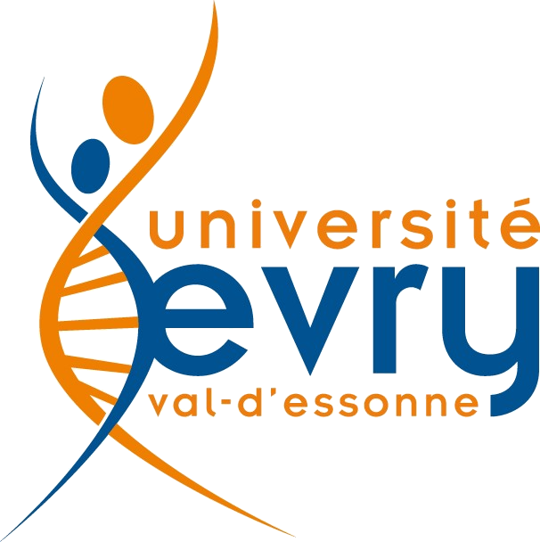
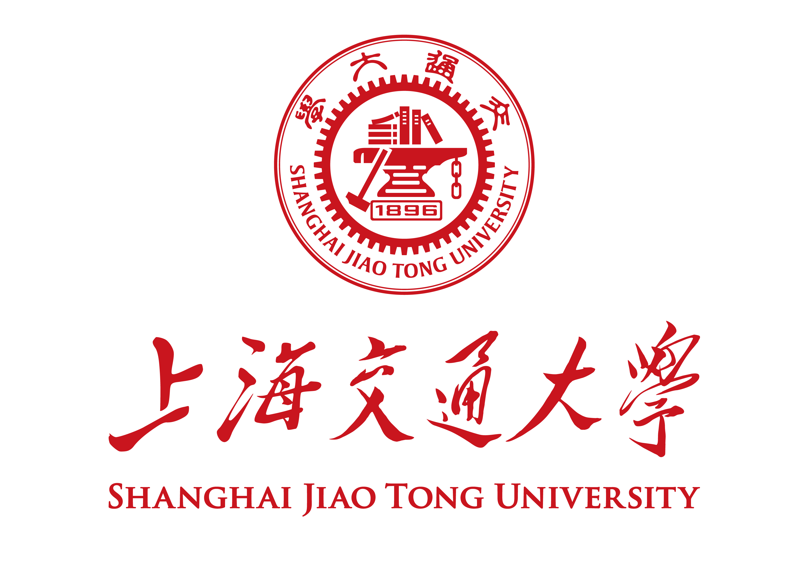
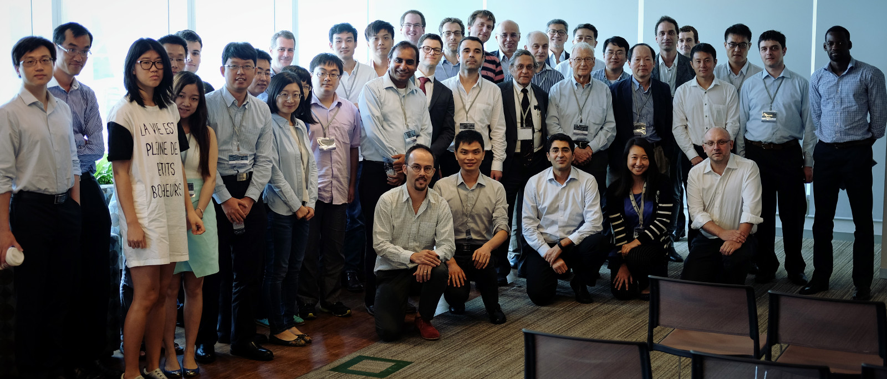

{:width="100%"}

<ul class="flex-container" markdown="1">
  <li class="flex-item" markdown="1">
  {:width="50%" style="display: inline-block"}
  </li>
 <li class="flex-item" markdown="1">
  {:width="110%" style="display: inline-block"}
  </li>
  <li class="flex-item" markdown="1">
  {:width="60%" style="display: inline-block"}
  </li>
</ul>

## Risk Measures, XVA Analysis, Capital Allocation and Central Counterparties
{: style="text-align:center"}

Second Workshop
{: style="text-align:center"}

 
  
**Place:** 
:   Shanghai Advanced Institute for Finance [(SAIF)](http://http://saif.sjtu.edu.cn/en)    
    [Shanghai Jiao Tong University](http://www.sjtu.edu.cn/)  
    West Huaihai Road 211, Shanghai, 200030 China

**Date:**
:   from October 27th to 29th

**Room:**
:   To be announced

**Program:**
:   To be announced.

**Registration:**
:   Attendance is free and open to everyone. Please send a mail at <sdrapeau@saif.sjtu.edu.cn> to notify your presence in order to estimate the capacity and keep you informed about eventual program changes.

 

## Overview

In the aftermath of the global financial crisis, new issues were raised concerning accurate derivative pricing and the sound risk assessment thereof. On the one hand, several valuation adjustments (XVAs), such as credit valuation adjustment (CVA), funding valuation adjustment (FVA) or capital valuation adjustment (KVA), were introduced to account for the inherent incompleteness of financial markets. On the other hand, from the risk assessment point of view, one sees a growing concern for the systemic dimension and how to account for it in the capital allocation among different components of a financial system. A related evolution of the infrastructure of financial markets is the generalization of centrally cleared trading and central counterparties (CCPs).

All these changes pose important questions at the boundary between challenging academic questions and relevant industrial applications. To address these issues, the University of Evry, Shanghai Jiao Tong University and National University of Singapore are jointly organizing two companion workshops on Risk Measures, XVA Analysis, Cost of Capital and Central Counterparties.

The first workshop has been held at the Standard Chartered Bank in Singapore on 18-19 April 2016.  

### Members of the Organizing Committee:

* Stéphane CRÉPEY (University of Evry, France)
* Min DAI (National University of Singapore, Singapore)
* Samuel DRAPEAU (Shanghai  Jiao Tong University, China)
* Steven KOU (National University of Singapore, Singapore)
* Alexandre THIERY (National University of Singapore, Singapore)
* Chao ZHOU (National University of Singapore, Singapore)

### Speakers

|-----------------------+-----------------------------------------------------------------------+
| Name                  | Institution                                                           |
|:----------------------|:----------------------------------------------------------------------|
| Agostino Capponi      | Columbia University, USA                                              |
| Patrick Cheridito     | ETH Zürich, Switzerland                                               |
| Freddy Delbaen        | Department of Mathematics ETH Zurich, Institute of Mathematics UZH, Tokyo Metropolitan University |
| Karl-Theodor Eisele   | Université de Strasbourg, France                                      |
| Jean-Pierre Fouque    | UC Santa Barbara, USA                                                 |
| Hans Föllmer          | Humboldt University of Berlin, Germany                                |
| Marco Fritelli        | Università degli Studi di Milano, Italy                               |
| Samim Ghamami         | Federal Reserve Board, UC Berkeley, NYU, USA                          |
| Michael Kupper        | Konstanz University, Germany                                          |
| Thilo Meyer-Brandis   | Ludwig-Maximilians University, Munich, Germany                        |
| Antonis Papapantoleon | Technical University of Berlin, Germany                               |
| Shige Peng            | Shandong University, China                                            |
| Dylan Possamai        | Université Paris Dauphine, France                                     |
| Birgit Rudloff        | Vienna University of Economics and Business, Austria                  |
| Marek Rutkowski       | University of Sydney, Australia                                       |
| Shiqi Song            | Université d’Evry, France                                             |
| Stephan Sturm         | Worcester Polytechnic Institute, USA                                  |
| Stefan Weber          | Leibniz Universität Hannover, Germany                                 |
| Lan Wu                | Beijing University, China                                             |
| Chao Zhou             | National University of Singapore, Singapore                           |
|=======================|=======================================================================|

### Sponsors:

* Center for Quantitative Finance
* Chair Markets in Transition under the aegis of Louis Bachelier laboratory (a joint initiative of Ecole polytechnique, Université d'Evry Val d'Essonne and Fédération Bancaire Française)
* China Academy of Research in Finance (CMAR/CAFR/SAIF), Shanghai Jiao Tong University
* Europlace Institute of Finance Grant "Collateral Management in Centrally Cleared Trading"
* National Natural Science Foundation of China (NSFC) "Systemic Risk and Uncertainty in Finance", Grant number 11550110184.
* National University of Singapore Grant ''Mathematical Treatments of some Problems in Quantitative Finance"
* National University of Singapore Grant ''Monte-Carlo Methods for Inference in Complex Stochastic Systems''

### Contact us:

For any additional information, do not hesitate to contact <sdrapeau@saif.sjtu.edu.cn>.

### [Last Workshop in Singapore](http://cqf.nus.edu.sg/NUS_SJTU_Evry_Workshop/Overview.html)

